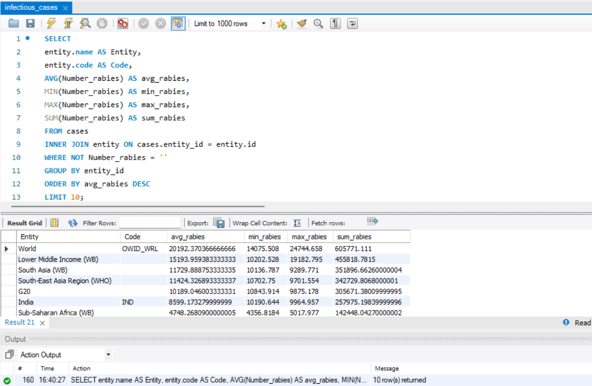

# Realational Databases: Final Project

1. Завантажте дані:

- Створіть схему `pandemic` у базі даних за допомогою SQL-команди.
- Оберіть її як схему за замовчуванням за допомогою SQL-команди.
- Імпортуйте дані [infectious_cases.csv](./data/infectious_cases.csv) за допомогою Import wizard.

[**SQL**](./task_1.sql)

2. Нормалізуйте таблицю `infectious_cases`. Збережіть у цій же схемі дві таблиці з нормалізованими даними.

[**SQL**](./task_2.sql)

[Result table - entity](./data/entity.csv)

[Result table - cases](./data/cases.csv)

3. Проаналізуйте дані:

- Для кожної унікальної комбінації Entity та Code або їх id порахуйте середнє, мінімальне, максимальне значення та суму для атрибута `Number_rabies`.
- Врахуйте, що атрибут Number_rabies може містити порожні значення "" — вам попередньо необхідно їх відфільтрувати.
- Результат відсортуйте за порахованим середнім значенням у порядку спадання.
- Оберіть тільки 10 рядків для виведення на екран.

[**SQL**](./task_3.sql)

4. Побудуйте колонку різниці в роках. Для колонки `Year` побудуйте з використанням вбудованих SQL-функцій:

- атрибут, що створює дату першого січня відповідного року. Наприклад, якщо атрибут містить значення `1996`, то значення нового атрибута має бути `1996-01-01`.
- атрибут, що дорівнює поточній даті,
- атрибут, що дорівнює різниці в роках двох вищезгаданих колонок.

[**SQL**](./task_4.sql)

5. Побудуйте власну функцію.

- Створіть і використайте функцію, що будує такий же атрибут, як і в попередньому завданні: функція має приймати на вхід значення року, а повертати різницю в роках між поточною датою та датою, створеною з атрибута року (`1996` → `1996-01-01`).

[**SQL**](./task_5_1.sql)

- Створіть і використайте функцію, що рахує кількість захворювань за певний період. Для цього треба поділити кількість захворювань на рік на певне число: 12 — для отримання середньої кількості захворювань на місяць, 4 — на квартал або 2 — на півріччя. Таким чином, функція буде приймати два параметри: кількість захворювань на рік та довільний дільник. Ви також маєте використати її — запустити на даних. Оскільки не всі рядки містять число захворювань, вам необхідно буде відсіяти ті, що не мають чисельного значення (`≠ ""`).

[**SQL**](./task_5_2.sql)

